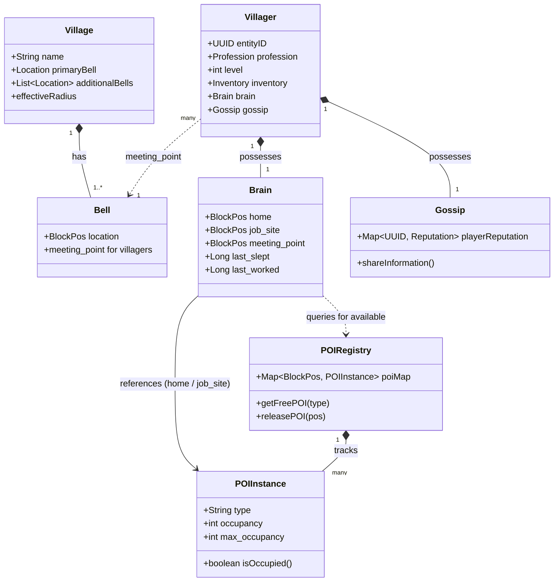

# Minecraft Village Data Structure (UML)

This document describes how the **organized entity** of a Minecraft village is represented as data: the POI (Point of Interest) Registry, the Villager's Brain, and the Gossip system. HyEmpires uses only **Brain memories** (home, job_site, meeting_point) to determine who lives in a village and to show observability; the diagram below is the full picture the plugin should consider.

---

## 1. The Three Pillars

| System | Location | Role |
|--------|----------|------|
| **POI Registry** | World folder `/region/poi/` | Master map of every critical block (beds, workstations). Each POI is tagged (e.g. `minecraft:home`, `minecraft:fisherman`) and has status **Free** or **Occupied**. |
| **Villager Brain** | Entity NBT (`memories`) | Each villager stores **home**, **job_site**, **meeting_point** (bell). The brain is the "connection" that links the villager to the POI. |
| **Gossip** | Entity NBT (social) | Player reputation, gossip list, offers, willing (breeding). Social hierarchy and trading data. |

**Validation:** The game periodically checks: "Is my bed still at these coordinates?" If the block is broken, the memory is cleared and the POI is released.

---

## 2. Class Diagram (Mermaid)



---

## 3. Relationships (Plugin-Relevant)

- **The Bell** is the anchor ("Town Square"). Villagers store its position as **meeting_point** in their Brain. **Who lives in the village** = all villagers whose `meeting_point` equals that bell (or whose home/job_site fall within the bell’s radius, depending on API).
- **The Brain** does not "own" the bed; it stores a **memory** (coordinates). If the block is destroyed, the memory is invalidated and the link breaks.
- **POI Registry** is loose coupling: the village is effectively a cluster of POIs (beds, workstations) that are close enough to the bell. The plugin does **not** read POI files; it uses **Brain memories** (e.g. `MemoryKey.HOME`, `MemoryKey.JOB_SITE`, and where available `MemoryKey.MEETING_POINT`) for observability.
- **Gossip** holds player reputation and social data; relevant for trading and reputation. The **Trading token** (master trading menu) aggregates **Offers** from all villagers that use the bell as meeting point.

---

## 4. NBT Snippet (Brain Memories)

In villager entity NBT, the link to bed and workstation looks like:

```nbt
Brain: {
  memories: {
    "minecraft:job_site": {
      value: [I; -120, 64, 250]
    },
    "minecraft:home": {
      value: [I; -115, 64, 260]
    },
    "minecraft:meeting_point": {
      value: [I; -100, 64, 240]
    }
  }
}
```

HyEmpires uses the Bukkit/Paper API equivalents: `MemoryKey.HOME`, `MemoryKey.JOB_SITE`, and (where supported) the meeting point for "who uses this bell."

---

## 5. Tokens and What They Use

| Token | Obtained | Purpose |
|-------|----------|---------|
| **Administration token** | Right-click bell with **paper** | See **who lives in the village** (which villagers use this bell as meeting point). Opens admin menu: population by type, villagers by profession. No bed/workstation location tracking. |
| **Trading token** | Right-click bell with **emerald** | Open **master trading menu**: all villagers that use this bell as meeting point, with their trades in one GUI (no need for a physical trading hall). |

Both tokens are scoped to **one bell**; "village" for the plugin is defined by that bell (and optionally radius) and by the game’s data (Brain: home, job_site, meeting_point).
